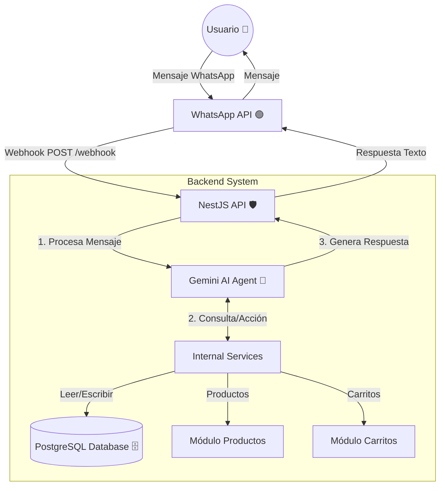

# Arquitectura de Alto Nivel

Este documento detalla la arquitectura técnica del sistema, componentes principales, diagrama de flujo y especificación de endpoints. Diseñado para ser replicable por otro sistema de IA o equipo de desarrollo.

## 1. Diagrama de Arquitectura

## 2. Componentes Principales

### **1. LLM / Agente de IA (Gemini)**
- **Motor:** Google Gemini 2.5 Flash.
- **Responsabilidad:** Interpretar la intención del usuario (buscar productos, comprar, ver carrito) y ejecutar herramientas (“Tools”) para interactuar con el backend.
- **Personalidad:** Experto en ventas, cálido y empático.

### **2. API REST (NestJS)**
- **Framework:** NestJS (Modular).
- **Responsabilidad:** Orquestar la lógica de negocio, exponer endpoints para el webhook de WhatsApp y proveer acceso a datos para el Agente.
- **Estructura:** Modular (`src/modules/*`), separando dominios como `products`, `carts`, `whatsapp`.

### **3. Base de Datos (PostgreSQL)**
- **ORM:** TypeORM.
- **Entidades Principales:**
    - [`Product`](../src/products/entities/product.entity.ts): Catálogo de inventario
    - [`Cart`](../src/carts/entities/cart.entity.ts): Sesión de compra del usuario
    - [`CartItem`](../src/carts/entities/cart-item.entity.ts): Relación producto-cantidad en un carrito

### **4. Servicios Externos**
- **WhatsApp (Twilio/Meta):** Canal de comunicación con el cliente.
- **Google Generative AI:** Proveedor del modelo de inteligencia artificial.

---

## 3. Especificación de Endpoints

### 🛒 Módulo Carritos (`/carts`)
| Método | Endpoint | Descripción | Payload / Params |
| :--- | :--- | :--- | :--- |
| `GET` | `/carts/user/:userId` | Obtiene el carrito activo de un usuario. | `userId`: string (teléfono) |
| `POST` | `/carts/add-item` | Agrega un producto al carrito o actualiza cantidad. | `{ userId, productId, qty }` |
| `PATCH` | `/carts/:id` | Modifica un ítem específico en el carrito. | `{ productId, qty }` |

### 🛍️ Módulo Productos (`/products`)
| Método | Endpoint | Descripción | Payload / Params |
| :--- | :--- | :--- | :--- |
| `GET` | `/products` | Busca productos con filtros (búsqueda semántica/texto). | `?q=termino` |
| `GET` | `/products/:id` | Obtiene detalle de un producto específico. | `id`: number |
| `GET` | `/products/seed/run` | (Dev) Poblar base de datos desde Excel. | N/A |

### 🟢 Módulo WhatsApp (`/whatsapp`)
| Método | Endpoint | Descripción | Payload / Params |
| :--- | :--- | :--- | :--- |
| `POST` | `/whatsapp/webhook` | Recibe mensajes entrantes de WhatsApp. | JSON Webhook Twilio |

---

## 4. Flujo de Interacción del Agente

Ver documento detallado en: [flow_map.md](./flow_map.md)

### Resumen del Flujo

1. **Recepción:** El mensaje llega al `WhatsappController` (src/whatsapp/whatsapp.controller.ts).
2. **Procesamiento:** El `AiService` (src/ai/ai.service.ts) recibe el texto y lo envía al `GeminiAgent` (src/ai/gemini.agent.ts).
3. **Razonamiento:** El LLM decide si responder con texto puro o llamar a una herramienta (`getProducts`, `addToCart`).
4. **Ejecución:**
   - Si llama a una herramienta: El agente hace una petición HTTP a la API de NestJS.
   - La API consulta la base de datos y devuelve el JSON.
5. **Respuesta:** El LLM toma el JSON, lo formatea con "tacto comercial" y devuelve la respuesta final al usuario vía WhatsApp.

