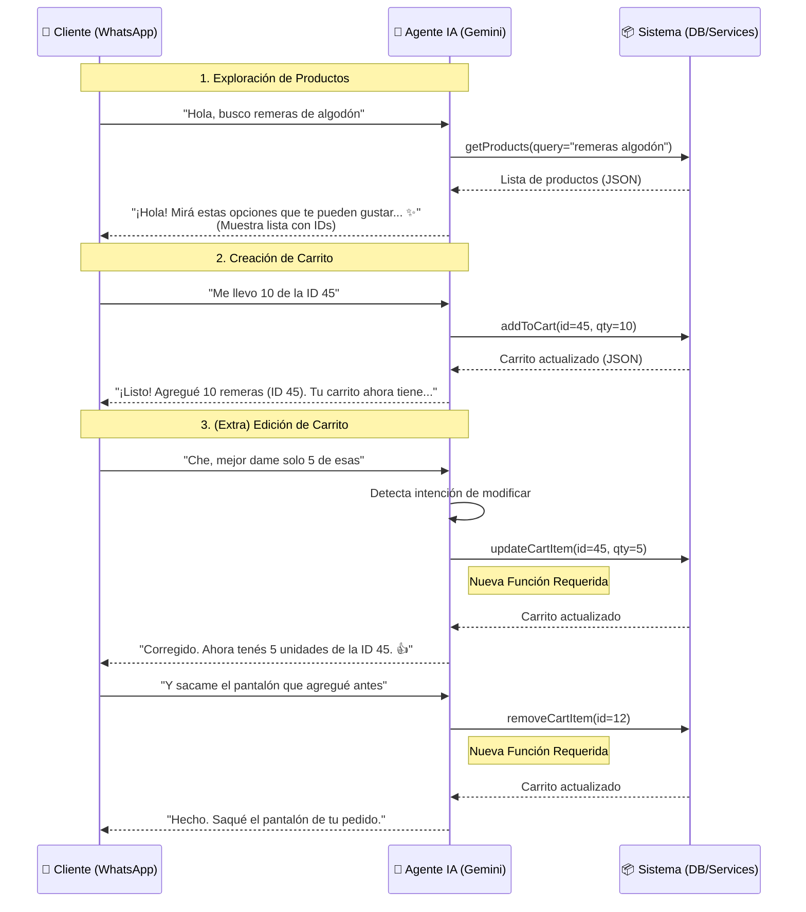

# Mapa de Flujo: Agente de Ventas con IA

Este diagrama ilustra la interacción entre el Usuario (Cliente), el Agente IA (Gemini) de WhatsApp y el Sistema Backend.

```mermaid
sequenceDiagram
    participant User as 👤 Cliente (WhatsApp)
    participant AI as 🤖 Agente IA (Gemini)
    participant Backend as 📦 Sistema (DB/Services)

    Note over User, AI: 1. Exploración de Productos

    User->>AI: "Hola, busco remeras de algodón"
    AI->>Backend: getProducts(query="remeras algodón")
    Backend-->>AI: Lista de productos (JSON)
    AI-->>User: "¡Hola! Mirá estas opciones que te pueden gustar... ✨" <br/> (Muestra lista con IDs)

    Note over User, AI: 2. Creación de Carrito

    User->>AI: "Me llevo 10 de la ID 45"
    AI->>Backend: addToCart(id=45, qty=10)
    Backend-->>AI: Carrito actualizado (JSON)
    AI-->>User: "¡Listo! Agregué 10 remeras (ID 45). Tu carrito ahora tiene..."

    Note over User, AI: 3. (Extra) Edición de Carrito

    User->>AI: "Che, mejor dame solo 5 de esas"
    AI->>AI: Detecta intención de modificar
    AI->>Backend: updateCartItem(id=45, qty=5)
    Note right of AI: Nueva Función Requerida
    Backend-->>AI: Carrito actualizado
    AI-->>User: "Corregido. Ahora tenés 5 unidades de la ID 45. 👍"

    User->>AI: "Y sacame el pantalón que agregué antes"
    AI->>Backend: removeCartItem(id=12)
    Note right of AI: Nueva Función Requerida
    Backend-->>AI: Carrito actualizado
    AI-->>User: "Hecho. Saqué el pantalón de tu pedido."
```
